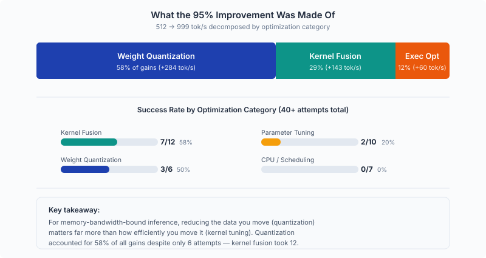
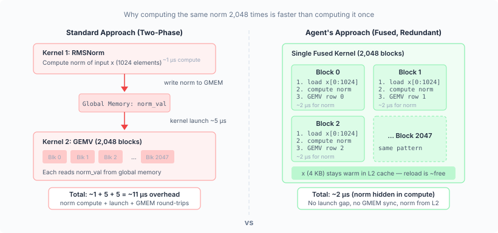
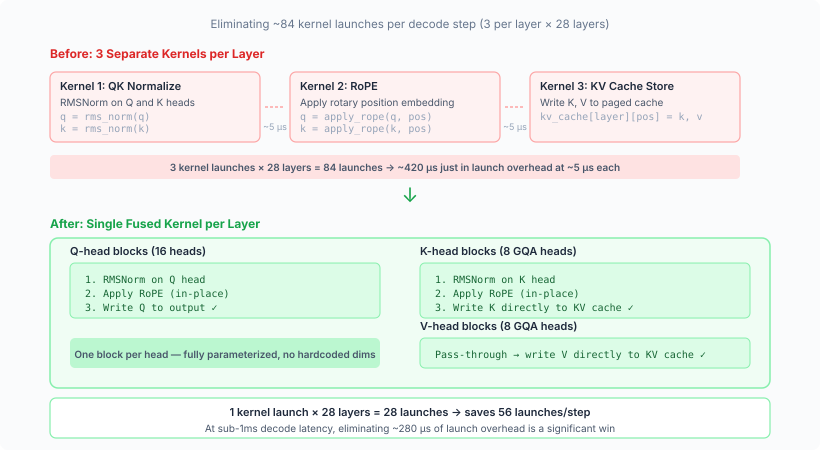
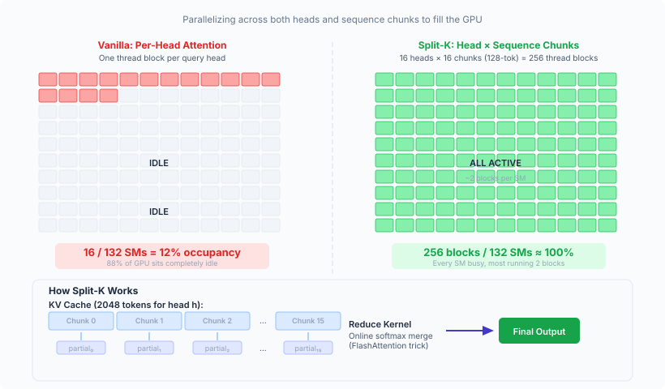
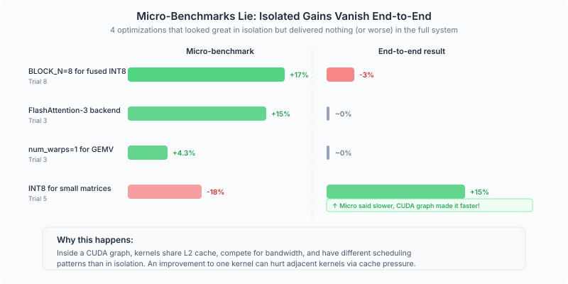

# Self-Evolving Inference: When AI Agents Write GPU Kernels

> A deep dive into what happens when you let Claude evolve on a real inference engine: the breakthroughs, the bugs, and the lessons that surprised us.
> 

## 1. Introduction & Vision

We gave Claude a simple task: make this inference engine faster. The target was link, a lightweight LLM serving engine, running Qwen3-0.6B on an NVIDIA RTX PRO 6000 Blackwell GPU at batch size 1. The baseline is 512 tok/s. 

Over 10 sequential trials, Claude wrote 3,700 lines of Triton and CUDA code, fused kernels, introduced INT8/INT4 quantization, redesigned the attention mechanism, and pushed throughput to 1,016 tok/s, nearly doubles the original performance and leaves SGLang and TensorRT-LLM far behind on this workload. No human wrote or suggested any of the optimization strategies.

This article is what came out of reading the resulting code for all trials. We open the hood on 26 changed files and ask these questions: *Is the code correct? Is it clever or just complicated? What are the bugs?* We found 8 genuinely impressive optimizations, 1 silent correctness bug, 2 race conditions, and ~1,200 lines of dead code the agent never cleaned up. What follows below is our analysis.

## 2. What the 95% Improvement Was Actually Made Of

The single most important insight: for memory-bandwidth-bound inference, *reducing the data you move* matters far more than *moving it more efficiently*. The agent spent 4 trials (1–4) improving bandwidth utilization from 58% to 68% of peak, gaining +164 tok/s. Then trial 5 halved the data with INT8, gaining +184 tok/s in one trial.

<aside>
💡

**Gain Composition:** Kernel fusion was the reliable workhorse (58% success rate, moderate gains). Parameter tuning was mostly wasted effort (20% success rate). CPU optimizations were 0-for-7 because the system was GPU-boun

</aside>

## 3. What the Agent Built Well

### Fused RMSNorm + GEMV: The "Redundant but Right" Trade-off

The agent's most architecturally interesting decision was in how it fused the layer normalization into the matrix-vector multiply.

The standard approach would be: compute the norm once, write the result to memory, then read it back for the GEMV. The agent chose a different path — every GEMV block (for example, the QKV projection launches 2,048 blocks at bs=1) independently reloads the input vector and recomputes the norm from scratch. That's 2,048× redundant compute for the normalization.

Why is this actually smart? Because the alternative — computing the norm once and synchronizing across blocks — would require either an inter-block barrier (which CUDA doesn't natively support within a single kernel) or a two-phase kernel (which adds a kernel launch). For a 1024-element vector, each block's redundant norm costs ~2 microseconds of compute, but it saves ~5-10 microseconds of launch overhead and memory round-trips. The agent found the counterintuitive answer: *doing the same work 500 times is faster than doing it once and sharing.*

What's especially notable is that by Trial 8, the agent had learned to evolve this further. The INT4 variant (`fused_norm_gemv_int4.py`) uses a two-phase design — compute the norm once in Phase 1, then loop over weight groups in Phase 2. The agent discovered that the redundant-norm trick works for bf16 weights (small enough to fit in one tile) but breaks down for INT4 (where the group-loop structure makes redundant loading too expensive). It adapted its own pattern.

**Transferability: Fully general.** Works for any model. The constraint itself is not fundamental — `BLOCK_M` could be parameterized as `next_power_of_2(hidden_size)` — but the current implementation hardcodes `BLOCK_M = 1024`.

### Fused QKNorm + RoPE + KV Store: Three Kernels Become One

For each of the 28 transformer layers, the decode path originally launched three separate kernels: QK normalization, rotary position embedding (RoPE), and KV cache storage. The agent fused all three into a single kernel where each thread block handles one attention head. Q-head blocks apply norm + RoPE in-place. K-head blocks apply norm + RoPE, then write directly to the KV cache. V values pass through untouched.

This is clean, correct, and fully parameterized — no hardcoded dimensions. It eliminates ~84 kernel launches per decode step (3 saved per layer × 28 layers). For a pipeline where total step time is under 1ms, that's meaningful.

**Transferability: Fully general** for any GQA model with RoPE and QKNorm.

### Split-K Decode Attention: Better SM Utilization

The agent's most ambitious kernel was a custom attention implementation replacing FlashInfer's decode path. The insight: for bs=1 with only 16 query heads, vanilla per-head attention launches only 16 thread blocks on a GPU with 132 SMs. Most of the GPU sits idle.

The agent parallelized across both heads *and* sequence chunks (128-token blocks). This expands the grid from 16 blocks to 16 × 16 = 256, achieving much better SM occupancy. A second reduction kernel merges the partial results using the online softmax trick from the FlashAttention paper.

The algorithm is textbook split-K attention. The implementation is clean.

**Transferability: Algorithm is fully general.** But the implementation has a critical bug (see below).

### Other Good Ideas (Quick Hits)

- **In-graph argmax:** Capturing `torch.argmax` inside the CUDA graph for greedy decode eliminates one kernel launch per step. This is a simple, correct, clean, and general fallback for non-greedy sampling.
- **Pre-allocated decode metadata:** Reuses pinned CPU tensors instead of allocating new ones every step. Saves ~30-60µs of Python allocation overhead per step. General.
- **`skip_store` API extension:** A clean backward-compatible flag on all attention backends that enables fused KV preparation without double-storing. Good interface design. General.
- **INT8/INT4 weight quantization:** Standard per-row (INT8) and per-group (INT4, group_size=128) symmetric quantization. Reduces GEMV memory traffic by 2-4x. The packing and unpacking logic is correct. General.
- **Multi-step CUDA graph:** Captures 4 sequential decode forward passes in a single graph replay. Amortizes graph launch overhead across 4 tokens. Innovative, but fragile (any model change silently breaks the captured graph). General concept, specific implementation.

## 4. What the Agent Got Wrong

### The Silent 2048-Token Cliff

The split-K attention kernel hardcodes `_NUM_CHUNKS_PAD = 16` and `_BLOCK_SEQ = 128`, meaning it can attend to at most 128 × 16 = 2,048 tokens. If the sequence is longer, chunks beyond index 15 are simply never computed. No assertion. No error. No warning. The kernel just silently ignores those tokens and produces wrong attention outputs.

The benchmark happens to stay under this limit (short prompts + 128 output tokens), so the agent never encountered the bug during its optimization loop. But `max_seq_len` is set to 4,096. Any real workload generating more than ~1,000 output tokens would hit this wall.

This is the canonical example of **reward hacking through benchmarks**: the agent optimized for the benchmark it could measure, and the benchmark didn't test the edge case. The optimization is "correct" on the benchmark and silently broken in production.

**Fix:** Make `_NUM_CHUNKS_PAD` dynamic, derived from `max_seq_len` at initialization.

### Two Race Conditions in the Mega-Fused Kernel

The agent's most ambitious kernel — `fused_qknorm_attn.py`, which fuses QKNorm + RoPE + KV Store + Split-K Attention + Reduction into a single launch — contains two race conditions:

**Race 1: Q Scratch Buffer.** All 16 chunk-blocks for the same query head write their (identically computed) normalized Q values to the same global memory location. Then all 16 blocks read from that location for attention. There's no barrier between the writes and reads. While the values are identical, concurrent reads-during-writes across thread blocks are undefined behavior in CUDA. This could cause bit-level corruption in attention scores on some hardware.

**Race 2: KV Cache Store (GQA).** With grouped-query attention (GQA ratio = 2 for Qwen3-0.6B), two query-head blocks share one KV head. Both attempt to write K/V to the same cache location. Same issue — identical data, no synchronization, technically undefined.

Neither race is *likely* to cause visible errors on current NVIDIA hardware (same-value WAW races are practically benign on A100/H100). But they're the kind of thing that breaks silently when you move to a new GPU architecture or when the compiler decides to optimize differently.

**Fixes:** For Race 1, compute Q in registers per-block instead of sharing via global scratch. For Race 2, guard the KV store with `qo_head % GQA_RATIO == 0`.

### The Atomic Counter Time Bomb

The mega-fused kernel uses an atomic counter to coordinate which block performs the final attention reduction. The counter is initialized to zero once and never reset. Because the counter is shared across all 28 layers, each decode step adds 448 (16 per chunk-block × 28 layers sharing the same counter). After ~4.79 million forward passes — approximately **1.9 hours** of continuous generation at 700 tok/s — the signed int32 counter overflows. The modulo check that triggers reduction breaks, and attention output becomes stale.

While this isn’t a concern for benchmarks, this is a real problem for any long-running deployment.

**Fix:** Use a bitmask instead of modulo: `(old_count + 1) & (NUM_CHUNKS - 1) == 0`. Works correctly for all uint32 values when NUM_CHUNKS is a power of 2 (it's 16).

## 5. What This Teach Us About AI as a Kernel Author

### The Generalization Gap

Every optimization is hardwired to Qwen3-0.6B at batch size 1. Here's what breaks if you change the model:

| Assumption | What breaks |
| --- | --- |
| `hidden_size = 1024` | All fused GEMV kernels crash with `AssertionError` for any larger model |
| `max_seq_len ≤ 2048` | Split-K attention silently produces wrong output |
| `batch_size = 1` | All fusions fall back to unoptimized standard path |
| `activation = silu` | Fused decode path is skipped (harmless fallback) |
| `hidden_size % 128 = 0` | INT4 quantization crashes |
| Triton GEMV thresholds | Tuned for Qwen3-0.6B matrix sizes; may regress on other models |

This is by design: the experiment explicitly allowed model-specific optimization. But it highlights a key limitation of the current approach: **the agent optimizes for the scenario it can measure, not the scenario you'll deploy.**

### The Dead Code Problem

About 1,200 lines (a third of the new code) are dead. The persistent forward kernel, an ambitious attempt to run the entire 28-layer forward pass in a single cooperative-groups kernel, was abandoned after achieving only 75 tok/s vs 840 baseline. The agent disabled it with a comment but never deleted the code. Three progressively-fused versions of the QKNorm kernel exist because each trial added a new file rather than extending the previous one. An 88-line `fused_gemv_silu.py` is completely unreachable in the current code path.

This is what iterative AI development looks like without a cleanup phase: **geological layers of abandoned experiments, each preserved in the codebase.** For a research prototype, it's fine. For a production merge, it's a cleanup burden that should be explicitly scheduled as a refactoring step.

### Micro-Benchmarks Sometimes Lie

Even though each trial starts with a profiling phase, but sometimes evidence found through custom-written micro-benchmarks do not lead to final end-to-end improvement. 

> **Trial 8**: BLOCK_N=8 for fused INT8 kernels showed **17% faster** in isolated micro-benchmarks. End-to-end result: **-3% regression** (937 vs 965 tok/s).
> 

> **Trial 3**: `num_warps=1` for GEMV showed **4.3% faster** in 28-layer micro-benchmark. End-to-end: within noise.
> 

> **Trial 3**: FlashAttention-3 was **11-15% faster** than FA2 in attention micro-benchmark. End-to-end: within noise.
> 

Why? Inside a CUDA graph, kernels share L2 cache, compete for memory bandwidth, and have different scheduling patterns than when run in isolation. An optimization that helps one kernel in isolation can hurt the system by changing cache pressure on adjacent kernels.

<aside>
💡

**Never trust micro-benchmarks alone:** Always validate with end-to-end benchmarks. The agent in later trials would run micro-benchmarks for hypothesis generation, then immediately test end-to-end before committing.

</aside>