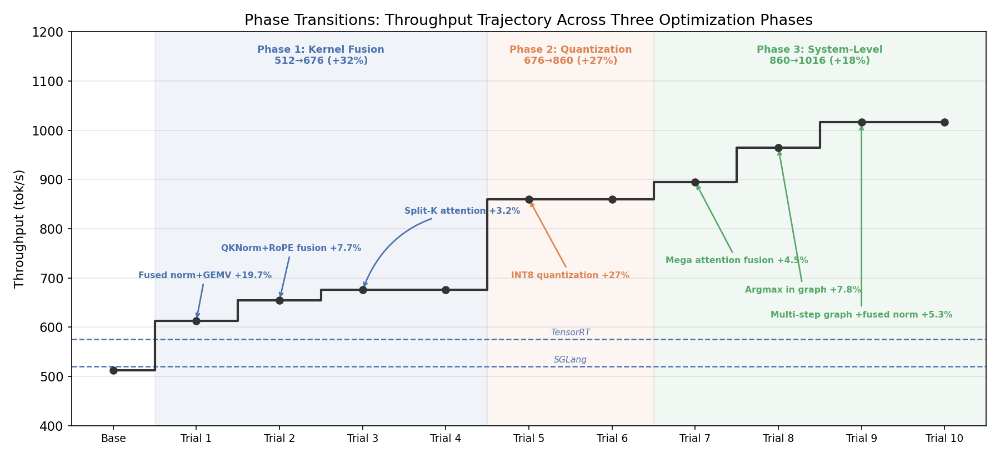
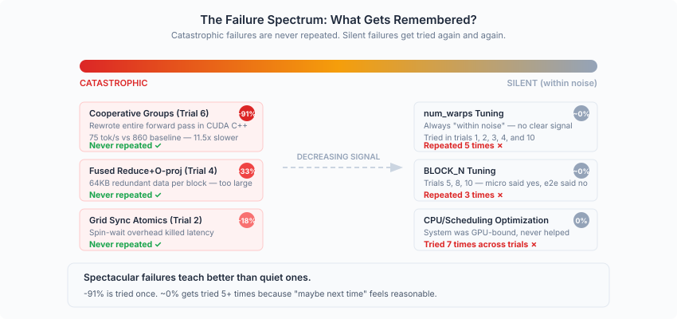

# Optimizing Mini-Sglang Inference as an Evolution Problem

> 
> 
> 
> We ran Claude Code in 10 sequential sessions to optimize Qwen 0.6B inference with mini-sglang on an NVIDIA RTX PRO 6000 Blackwell GPU, achieving 512 → 1016 tok/s (+98%). Each session read the prior session's notes, profiled the system, and decided what to try next — without human guidance. This post is not about the kernels. It's about the process: how we designed a minimal scaffold that let an agent evolve, and what emerged from it.
> 

## Introduction

A growing body of work has shown that LLM agents can write code, fix bugs, and pass benchmarks. But most evaluations are one-shot: give the agent a task, measure whether it succeeds, and move on. We were curious about something different: what happens when you let an agent *iterate*? Not once, but repeatedly: reading its own prior work, diagnosing what failed, deciding what to try next. Does it converge? Does it plateau? Does it discover things a human wouldn't?

To find out, we designed a minimal scaffold for agentic evolution. The task: optimize LLM inference throughput for Qwen3-0.6B on an NVIDIA RTX PRO 6000 Blackwell GPU. We ran it for 10 trials. The result: throughput nearly doubled, and the optimization trajectory revealed patterns e.g. punctuated equilibria, asymmetric failure memory, emergent risk aversion that we did not design for or expect.

This post examines the *mechanism*: how we built the scaffold, what behaviors emerged from it, and what structure the trials formed across iterations. We save the kernel-level engineering details for a companion post.

## Scaffolding Design

The entire system has four components. That's it.

**Fresh sessions.** Each trial is a new Claude Code session with full access to the codebase. The agent can modify the inference engine freely, but cannot touch the benchmark script. This removes a class of shortcuts. i.e. the agent cannot inflate numbers by changing the measurement. Combined with a strict correctness constraint (output tokens must be identical under greedy decoding), this ensures that every throughput gain is real.

**A single scalar signal.** The only feedback the agent receives is the throughput number: tokens per second. No partial credit, no component-level metrics (unless the agent decides to profile on its own), no human commentary. This is deliberately sparse and we wanted to see whether the agent could generate its own richer feedback through profiling and analysis, rather than relying on a hand-designed reward signal.

**A shared `learning.md` file.** This is the agent's only memory between sessions. Each trial reads it at startup and appends its findings at the end. Over 10 trials, it grew into a structured knowledge base, and its internal organization emerged from the agent's own choices.

### The Anatomy of learning.md

We did not prescribe a format for `learning.md`. The agent converged on a structure organically within the first two trials:

- **What Worked** — successful optimizations with measured gains
- **What Didn't Work** — failed attempts with brief explanations of why
- **Key Insights** — conceptual takeaways (e.g., "small-matrix GEMV is hardware-limited at 35% bandwidth utilization")
- **Suggestions for Next Trial** — concrete directions for the next session to explore
- **Do NOT Try** — a growing blacklist of approaches that have been conclusively eliminated

This structure is worth examining. The agent independently invented a knowledge management system that separates *facts* (what happened) from *interpretations* (why it happened) from *prescriptions* (what to do next) from *prohibitions* (what to never do again). The prohibitions turned out to be the most reliable section. We'll return to this.

The "Do NOT Try" list grew from 5 items after trial 3 to 13 items by trial 10. This accumulating negative knowledge progressively narrowed the search space, and was more reliably heeded than positive suggestions. In a sense, the agent's most durable learning was about what *not* to do.

### Why This Design Works

The scaffold is minimal by design. There is no multi-agent framework, no evolutionary search over populations, no learned reward model, no orchestrator selecting among candidates. Just one agent, one file of notes, and a throughput number to beat.

This minimalism matters because it makes the results interpretable. Every behavior we observe — risk aversion, explore-exploit transitions, paradigm shifts — emerged from the interaction between four simple components. If we had used a complex framework, we could not distinguish emergent behaviors from framework artifacts.

## The Topology of Trials

The 10 trials did not form a linear sequence of independent improvements. They formed a structured graph with dependencies, synergies, and path-dependent effects.

### Three Phases

The optimization trajectory divides into three phases, each driven by fundamentally different sources of improvement:

**Phase 1: Kernel Fusion (512 → 676 tok/s, +32%).** Trials 1–3 fused operations to reduce kernel launch overhead and improve memory bandwidth utilization. The gains came from reading the same data fewer times.

**Phase 2: Quantization (676 → 860 tok/s, +27%).** After trial 4 established the bf16 bandwidth wall, trial 5 introduced INT8 quantization, cutting weight traffic from 983 MB to ~490 MB per step. The gains came from reading *less* data per step which is a qualitative shift from improving read efficiency to reducing read volume.

**Phase 3: System-Level (860 → 1016 tok/s, +18%).** With weight bandwidth no longer the dominant bottleneck, non-weight overhead (kernel transitions ~20%, attention ~15%) became the target. Trials 6–10 applied graph-level and scheduling-level optimizations. The gains came from restructuring the computation graph itself.

Each phase transition required the agent to recognize that the previous optimization dimension was exhausted and to identify a new one. The overall trajectory looks less like gradient descent and more like evolution: long plateaus punctuated by sudden jumps when a new optimization paradigm is discovered.

### Compound Effects and Synergies

Optimizations across trials interacted in non-obvious ways.

**Amplification.** Trial 9 combined multi-step graph execution with fused norm. Multi-step graph reduced 128 decode iterations to 32 CPU round-trips; fused norm reduced the per-step kernel count. Together, the kernel savings from fused norm were *multiplied 4x* by the multi-step graph. The combined gain (+5.3%) was substantially larger than the sum of individual contributions (+1.7% + 0.5%). The agent explicitly noted this "synergistic effect" in its results.

**Bottleneck shifting.** Trial 5's INT8 quantization reduced weight traffic by 50%, which had an unexpected second-order effect: attention's share of total step time rose from ~10% to ~19%. This made trial 7's attention fusion (which eliminated 56 kernel launches) proportionally more impactful. Had trial 7 been done *before* trial 5, its absolute gain would have been smaller. The ordering of optimizations changed their individual attributions, even though the final result might converge to a similar point.

### Reverse Dependencies and Path Constraints

Some early decisions constrained or enabled later possibilities in ways the agent could not have anticipated.

Trial 1 established a fused norm+GEMV architecture where each block redundantly computes the norm. This was a good design choice at the time. But when trial 8 tried to fit INT4 dequantization into this same architecture, it hit register overflow. A different fusion architecture from trial 1 might have left space for INT4 to work. The early decision foreclosed a later path.

Conversely, trial 8's argmax-in-graph optimization (which moved sampling into the CUDA graph) was a prerequisite for trial 9's multi-step graph execution. The graph needed argmax captured inside it for multi-step to work. This created a dependency chain that the agent navigated successfully, though not by explicit planning.

### Path Dependence

These interactions mean the optimization trajectory is path-dependent. The final throughput might be similar under different orderings, but the intermediate trajectory especially *which optimizations appear to contribute how much* depends on the order.

Some optimizations are order-independent: kernel fusion and quantization are orthogonal and could be swapped without changing their individual gains. Others form dependency chains: argmax-in-graph must precede multi-step graph. Still others exhibit ordering-dependent attribution: INT8 before attention fusion makes the latter look larger; the reverse ordering would make INT8's contribution appear even bigger.

For agentic systems that maintain running notes about "what worked and by how much," this path dependence means that the recorded attributions are partially an artifact of the exploration order, not intrinsic properties of the optimizations. An agent that reasons too strongly from historical attributions might misjudge the importance of future optimizations.

## Emergent Behaviors

The most interesting findings are behaviors we did not specify by design. They arose from the scaffold's constraints interacting with the agent's capabilities.

### Asymmetric Failure Memory

We tracked whether failed approaches were repeated in later trials. The pattern is stark:

Catastrophic failures are never repeated. The -91% cooperative groups attempt in trial 6 permanently eliminated that direction — the agent never revisited it. The -33% fused reduce and -18% grid sync atomics were similarly one-and-done.

But silent failures — approaches that produced results "within noise" — were retried repeatedly. `num_warps` tuning was attempted five times across different trials. `BLOCK_N` tuning was tried three times. CPU/scheduling optimizations were attempted seven times. Each time, the agent reasoned that perhaps the conditions had changed enough to make the approach work.

This is not entirely irrational. In one case, `num_warps=1` *did* produce a +3.4% gain for QK norm but showed no effect on GEMV — demonstrating that conclusions are genuinely context-dependent. But in practice, the agent spent significant effort re-exploring dead ends that produced ambiguous signals, while never wasting a single trial on a direction that had failed dramatically.

The mechanism behind this is straightforward: a -91% regression produces an unambiguous "never do this" signal. A "within noise" result produces an ambiguous "maybe the conditions were wrong" signal. The `learning.md` file captured both outcomes faithfully, but only the dramatic failures generated entries strong enough to prevent revisitation.

**Implication for scaffold design:** if you want an agent to learn efficiently from failure, you may need to engineer stronger signals for inconclusive results — perhaps by requiring the agent to explicitly classify "within noise" attempts as closed investigations rather than open questions.

### Risk Aversion After Catastrophe

Before trial 6, the agent's plans were ambitious: "persistent mega-kernel for the entire forward pass," "cooperative groups to eliminate kernel transitions." These were high-risk, high-potential-reward strategies.

Trial 6 implemented one of these: 780 lines of CUDA code that rewrote the forward pass using cooperative groups. The result was a -91% throughput regression (75 tok/s vs. 860 baseline). The approach was fundamentally flawed — cooperative groups limited parallelism so badly that GEMV became 11x slower. The potential savings from eliminating kernel transitions (~200 μs) were dwarfed by the costs (700 μs slower GEMV + 130 μs sync overhead).

After this catastrophe, the agent's behavior visibly changed. Trial 7 chose a low-risk "small kernel fusion" strategy. More tellingly, trial 7 tested its fusion in two stages — first without the reduce operation, then with — rather than building monolithically. This incremental testing pattern was new; earlier trials had built and tested complete implementations in one shot.

The agent became more conservative not because we told it to, but because the `learning.md` narrative of trial 6's failure was vivid enough to shift its planning. This mirrors well-documented patterns in human decision-making under uncertainty, but here it emerged from nothing more than a text file and a throughput number.

### Profiling Intensity as a Function of Phase

We observed a U-shaped pattern in the agent's use of profiling:

- **Early trials (1–3):** Heavy profiling. Bottlenecks were obvious and measurable. Trial 1 profiled from scratch and found cuBLAS GEMV was using only 17% of memory bandwidth for small matrices, directly leading to custom Triton kernels that achieved 81%.
- **Middle trials (4–6):** Lighter profiling, more theoretical reasoning. The agent increasingly relied on calculations and architectural reasoning rather than empirical measurement. This is the phase where both the biggest win (INT8 quantization, +27%) and the biggest loss (cooperative groups, -91%) occurred.
- **Late trials (7–10):** Return to profiling, but with a different purpose. Rather than finding bottlenecks, profiling was used to *confirm* that no major bottlenecks remained — to verify arrival at the optimization frontier.

The pattern makes sense in retrospect: early profiling identifies low-hanging fruit; middle-phase reasoning explores structural changes where profiling alone doesn't suggest the answer; late-phase profiling validates diminishing returns. But the agent navigated this transition autonomously.

A key lesson from the middle phase: **successful paradigm shifts had quantitative predictions, while failed ones had qualitative reasoning.** Trial 5's INT8 quantization was preceded by concrete bandwidth calculations showing how much data volume reduction would help. Trial 6's cooperative groups were motivated by the qualitative intuition that "eliminating kernel transitions sounds good" — but without a full cost-benefit calculation, the hidden costs (parallelism loss, sync overhead) were not anticipated.

### The Explore-Exploit Transition

The agent's trajectory shows a clear shift from exploration to exploitation, but the transition was not smooth — it was driven by specific diagnostic events.

**Trial 4** tried five optimizations. All failed with zero throughput gain. Yet it was arguably the most important trial in the sequence. By exhaustively attempting micro-optimizations within the bf16 regime, it conclusively established the bandwidth wall: with 983 MB of bf16 weights per step at ~988 GB/s effective bandwidth, the system was at its physical limit. The agent wrote in `learning.md`: "Without quantization or a fundamentally different approach, ~676 tok/s is near the achievable limit for bf16 inference."

Trial 5 read this, adopted INT8 quantization, and produced the single largest improvement: +27%. The zero-improvement trial provided the *diagnosis* that made the breakthrough possible. This is a pattern worth naming: **failure as direction-finding**. Trial 4 eliminated a search space and pointed toward the correct paradigm shift.

Later, trial 10's seven failed parameter tuning attempts served the same function: they confirmed arrival at the optimization frontier, signaling that the evolution had converged.

## What We Learned

**Negative knowledge outlasts positive knowledge.** By trial 10, the agent had 13 confirmed dead ends — and it never repeated a catastrophic failure. But positive suggestions had only ~60-70% directional accuracy, and the specific implementation often needed adjustment. The "Do NOT Try" list was the most reliable section of `learning.md`. If you're designing inter-session memory for agents, invest in making the prohibition mechanism robust.

**Zero-gain trials can be the most valuable.** Trial 4 produced no throughput improvement but provided the diagnosis that enabled the +27% breakthrough in trial 5. Trial 10's seven failed attempts confirmed convergence. Evaluating agent performance purely on per-trial gains would mischaracterize these as wasted effort.

**Measure first, always.** Every successful paradigm shift was preceded by quantitative analysis — bandwidth calculations, profiling data, theoretical bounds. The one major failure (trial 6, -91%) was the one driven by qualitative intuition without a full cost-benefit analysis. This isn't a lesson about conservatism; trial 5's INT8 quantization was bold. It's a lesson about the difference between bold-with-evidence and bold-without-evidence.

**The scaffold matters more than the orchestrator.** We achieved a 98% throughput improvement with four components: fresh sessions, a frozen benchmark, a scalar signal, and a shared text file. No multi-agent debate, no population-based search, no learned reward model. The simplicity of the scaffold made every emergent behavior interpretable and every failure diagnosable. Whether more complex scaffolds would do better is an open question — but our result suggests that the floor for minimal scaffolding is higher than one might expect.

**Suggestions for Next Trial had ~60-70% directional accuracy.** The agent's own forward-looking suggestions pointed in roughly the right direction more often than not, but specific implementation strategies often needed adjustment. Notably, "cooperative groups" was suggested twice (by trial 3 and trial 5) and both times led to catastrophic failure — the suggestion mechanism could not self-correct on a dead end until it was actually tried. Persistent bad suggestions in the presence of good prohibitions suggests that the two systems (positive guidance vs. negative constraints) operate with different reliability characteristics.

**The evolution has a natural endpoint.** Trial 10 tried seven parameter tuning variants — all failed. Trial 9 produced a small gain but the agent explicitly acknowledged diminishing returns. The accumulating "Do NOT Try" list narrowed the search space until there was nothing left to explore. This is a feature, not a bug: a well-designed scaffold should let the agent recognize convergence rather than endlessly recycling old ideas. But it also means the scaffold's ceiling is bounded by the agent's ability to conceive of new paradigms. Once the known paradigm space is exhausted, evolution stops.